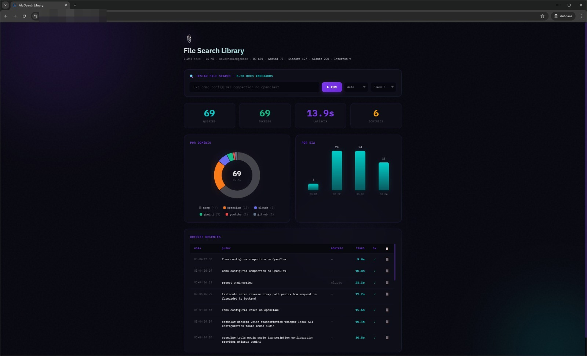
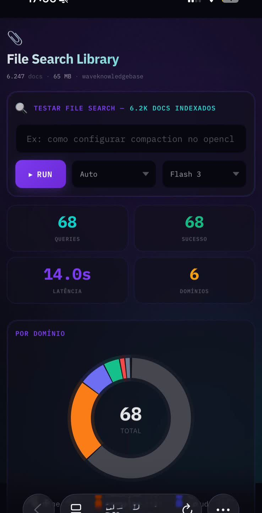
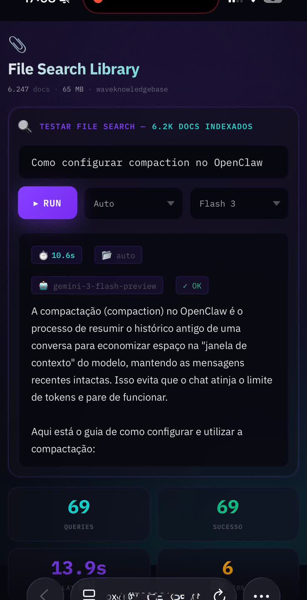
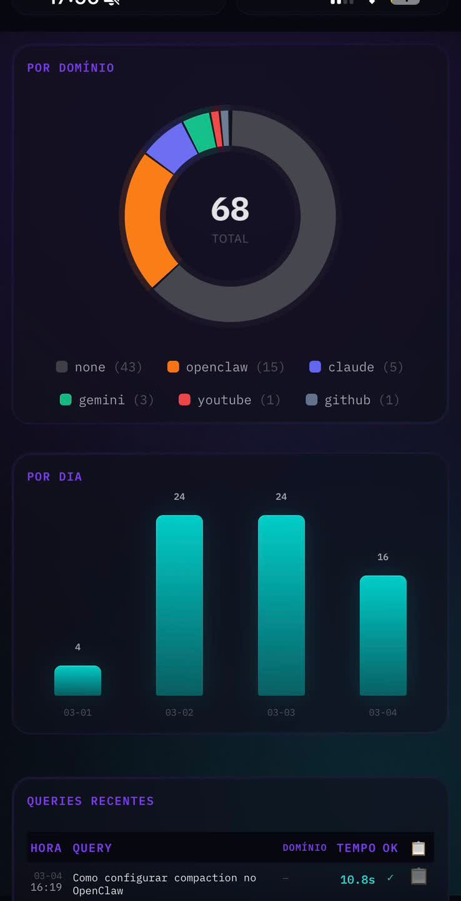
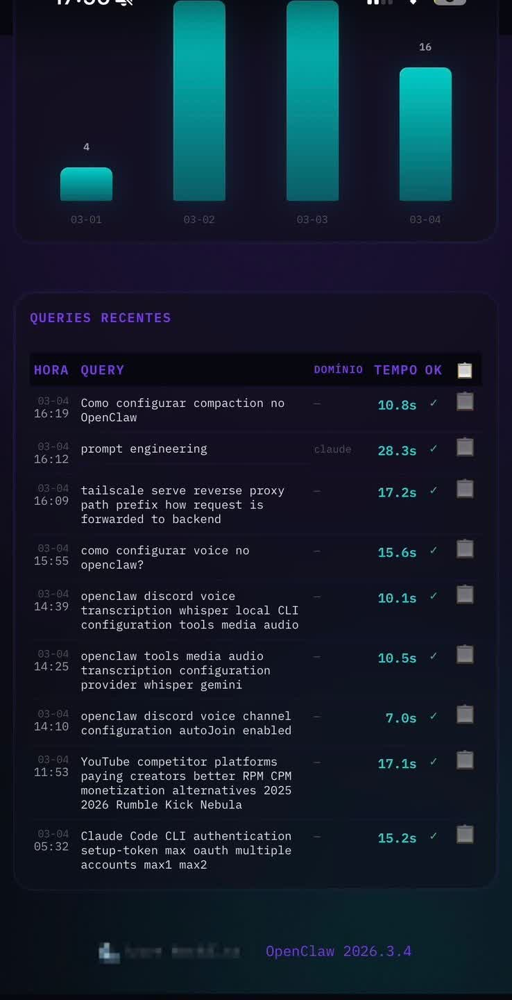

# Gemini File Search Dashboard

A premium, real-time dashboard for [Google Gemini File Search](https://ai.google.dev/gemini-api/docs/file-search) stores. Query your indexed documents, track metrics, and monitor store health — all from a single-page interface.



## Features

- 🔍 **Live Query Tester** — run File Search queries with domain filtering and model selection
- 📊 **Real-time Metrics** — query count, success rate, latency, domain distribution
- 🍩 **Donut Chart** — query distribution by domain (canvas, zero dependencies)
- 📈 **Daily Bar Chart** — queries per day with animated bars
- 📋 **Query History** — last 20 queries with one-click copy
- 📱 **Mobile Responsive** — optimized for phones, tablets, and desktop
- 🔒 **Secure** — input validation, rate limiting, no shell injection
- ⚡ **Zero Dependencies** — Node.js stdlib only, ~7KB server

## Screenshots

### Mobile

<p align="center">
  
  
  
  
</p>

## Quick Start

### Prerequisites

- Node.js 18+
- Python 3.10+ with `google-genai` package
- A Gemini API key ([get one here](https://aistudio.google.com/apikey))
- A File Search store ([create one here](https://aistudio.google.com/file-search-stores))

### Setup

```bash
git clone https://github.com/anthropics/gemini-filesearch-dashboard.git
cd gemini-filesearch-dashboard

# Install Python dependency
pip install google-genai

# Configure
cp .env.example .env
# Edit .env with your GOOGLE_API_KEY and STORE_ID

# Run
node server.js
```

Open `http://localhost:8899` in your browser.

### Environment Variables

| Variable | Required | Default | Description |
|----------|----------|---------|-------------|
| `GOOGLE_API_KEY` | ✅ | — | Your Gemini API key |
| `STORE_ID` | ✅ | — | File Search store ID (e.g., `fileSearchStores/abc123`) |
| `PORT` | — | `8899` | Server port |
| `BIND` | — | `127.0.0.1` | Bind address |
| `QUERY_SCRIPT` | — | `./query.py` | Path to the query script |
| `METRICS_FILE` | — | `./metrics.jsonl` | Path to metrics log |
| `PYTHON` | — | `python3` | Python binary path |
| `RATE_LIMIT` | — | `10` | Max queries per minute |
| `CORS_ORIGIN` | — | `*` | CORS allowed origin |

### Domain Prefixes

The query tester supports domain filtering to focus searches on specific document types:

| Domain | Prefix | Use Case |
|--------|--------|----------|
| Auto | *(none)* | Search all documents |
| OpenClaw | `[OPENCLAW]` | OpenClaw docs |
| Gemini | `[GEMINI API]` | Gemini API docs |
| Claude | `[CLAUDE API]` | Claude/Anthropic docs |
| Discord | `[DISCORD API]` | Discord API docs |
| YouTube | `[YOUTUBE]` | YouTube content |
| GitHub | `[GITHUB]` | GitHub docs |

To customize domains, edit the `DOMAIN_PREFIXES` dict in `query.py` and the `<select>` in `index.html`.

## Architecture

```
Browser ─── index.html (single page, canvas charts, no JS deps)
   │
   ├── GET  /api/metrics  → reads metrics.jsonl (aggregated stats)
   ├── GET  /api/store    → Gemini API store metadata (docs count, size)
   ├── POST /api/query    → executes query.py via execFile (no shell)
   └── GET  /api/health   → uptime check
   │
server.js (Node.js, stdlib only, ~7KB)
   │
query.py (google-genai SDK, logs to metrics.jsonl)
```

### Security

- **No shell injection** — uses `execFile` (not `exec`), arguments passed as array
- **Input validation** — query (unicode, 500 char max), domain (lowercase alpha), model (alphanumeric)
- **Rate limiting** — token bucket, configurable via `RATE_LIMIT`
- **Body size limit** — 16KB max POST body
- **HTML escaping** — query text escaped server-side before sending to client
- **Loopback only** — binds to `127.0.0.1` by default

### Deploying Behind a Reverse Proxy

Works with nginx, Caddy, Tailscale Serve, etc:

```bash
# Tailscale example (with trailing slash for prefix matching)
tailscale funnel --bg --set-path /filesearch/ 127.0.0.1:8899
```

> **Note:** When serving under a subpath, the HTML uses relative URLs (`api/query`), so the proxy path must end with `/`.

### systemd Service

```ini
[Unit]
Description=Gemini File Search Dashboard
After=network.target

[Service]
Type=simple
User=youruser
WorkingDirectory=/path/to/gemini-filesearch-dashboard
ExecStart=/usr/bin/node server.js
Restart=always
RestartSec=5
EnvironmentFile=/path/to/gemini-filesearch-dashboard/.env

[Install]
WantedBy=multi-user.target
```

## Customization

### Colors

Edit CSS variables in `index.html`:

```css
:root {
  --bg: #07070f;           /* Background */
  --accent: #7c3aed;       /* Purple accent */
  --secondary: #00cec9;    /* Teal secondary */
}
```

### Adding Domains

1. Add to `DOMAIN_PREFIXES` in `query.py`
2. Add `<option>` to the domain `<select>` in `index.html`
3. Add color mapping in the `domainColors` object in `index.html`

## Contributing

PRs welcome. Please keep zero-dependency philosophy.

## License

MIT
